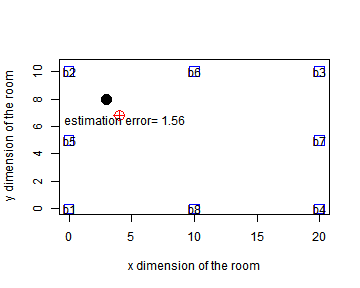

## What are beacons ?

Beacons are bluetooth low energy transmitters, which can be used for many applications. One of them is indoor navigation/ localization systems, where GPS cannot be used.

Beacons, as useful as they are, have also some shortcomings. Signal emmited by them may be unstable and noisy and without any filtering the precision of localization is not satisfactory. 

In application it is assumed that it followes path loss model, as in work of
[Zancagio, Zorzifra, Zanella, Zorzi]("http://www.dei.unipd.it/~zanella/PAPER/CR_2008/RealWSN08-CR.pdf")

$$ P_i = P_T  + K - 10 \eta log (d_i) + \Psi_i + \alpha_i(t)$$

where $\Psi_i$ and $\alpha_i(t)$ are random variables and $P_T  + K$ is constant, dependend on environment and signal strength calibrated at the beacon. $d_0$, distance used to measure $P_T$ is set to 1 [meter] and ommited in equation above.

--- .class #id 

## What aplication is doing ?

In predefined room of size 10x20 (meters) one can choose ones (receiver) position (black dot in user interface) and choose how many beacons are present.

 

According to choices, application reactively simulates strength of signal that would be received in choosen position and displays estimated position (red viewfinder) together with an estimation error.

--- .class #id 

## What is simulated and what is estimated ?

Becouse of randomness the computation of localization is biased. One can also use many algorithms to estimate this position - application uses simulated signal strength to recalulate distances from beacons and estimate the position using min-max method, as explained in work of [Langendoen and Reijers]("http://www.consensus.tudelft.nl/documents_papers/compnw.pdf")

## Have fun!

Change the position of receiver, change the number of beacons in the room and see how the strength of signal changes (barplot), together with your position ! :)

